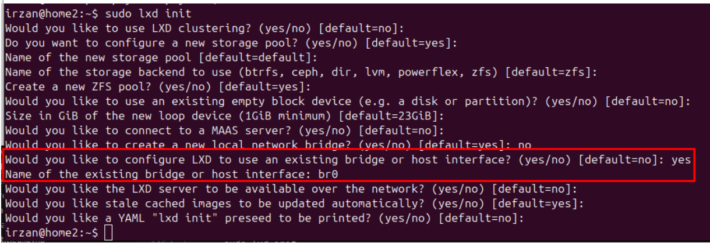

# how to automatically deploy vJunos on KVM, version 0.5

## Introduction
This repository contains my notes and python scripts to deploy multiple vJunos VMs on KVM on linux platform.

Official information on vJunos can be found [here](https://www.juniper.net/us/en/dm/vjunos-labs.html)

Official documentations on how to install vJunos on KVM :
- [vJunosRouter](https://www.juniper.net/documentation/us/en/software/vjunos-router/vjunos-router-kvm/index.html)
- [vJunosSwitch](https://www.juniper.net/documentation/us/en/software/vjunos/vjunos-switch-kvm/index.html)
- [vJunosEvolved](https://www.juniper.net/documentation/us/en/software/vJunosEvolved/vjunos-evolved-kvm/index.html)

The official documentation provide information on how to deploy individual vJunos VM on KVM using xml configuration file for libvirt and setup the bridge connection between vJunos VM manually.

The python script that I created, will perform the following tasks:
1. automatic deployment of bridges for connection between vJunos VMs
2. automatic deployment of multiple vJunos VM (vJunosRouter, vJunosSwitch or vJunosEvolved (virtual PTX10001-36MR)) 
3. initial configuration for vJunos VM which can be deployed using ZTP into the vJunos VM.
4. configuration file for kea-dhcp4-server required for ZTP process for vJunos initialization.

the initial configuration for vJunos VM will consist the following: 
1. Basic configuration, such as username/password for accessing the vJunos VM, ip address of management interface, enbling SSH server.
2. advance configuration, such as ipv4/ipv6 address for vJunos VM interfaces, routing protocol (for now only IS-IS), MPLS configuration (LDP/RSVP). SR-MPLS configuration, and SRv6 configuration.

## notes
This script is tested on ubuntu 24.04 + KVM + libvirt + python3 on supermicro E200-8d with 128G RAM and Intel NUC i7/64G RAM

## Preparing the host
1. Install base operating system. In my lab, I am using Ubuntu Linux 24.04
2. Install the following application 

       - kvm 
       - kea-dhcp4-server
       - tftpd-hpa
       - openswitch

       
       sudo apt install qemu-kvm libvirt-daemon-system libvirt-clients bridge-utils openvswitch-switch openvswitch-common kea-dhcp4-server tftpd-hpa

3. Create linux bridge to provide connection to the management interface of vJunos VM. for example the following netplan configuration file will create bridge **br0** with ip address **192.168.254.254/24**

       irzan@home2:/etc/netplan$ sudo cat /etc/netplan/02_net.yaml 
       network:
         bridges:
           br0:
             addresses: [ 192.168.254.254/24]
       irzan@home2:/etc/netplan$ sudo netplan apply
       irzan@home2:/etc/netplan$ ip addr show br0
       10: br0: <NO-CARRIER,BROADCAST,MULTICAST,UP> mtu 1500 qdisc noqueue state DOWN group default qlen 1000
       link/ether 4e:11:43:4c:7a:16 brd ff:ff:ff:ff:ff:ff
       inet 192.168.254.254/24 brd 192.168.254.255 scope global br0
              valid_lft forever preferred_lft forever
       irzan@home2:/etc/netplan$ 

4. Verify that ipv4 and ipv6 forwarding are enabled. Edit file /etc/sysctl.conf to make ipv4 and ipv6 forwarding persistent between reboot

       sudo sysctl -a | grep net.ipv6.conf.all.forwarding
       sudo sysctl -a | grep net.ipv4.ip_forward

       irzan@home2:/etc/netplan$ cat /etc/sysctl.conf | grep forward
       # Uncomment the next line to enable packet forwarding for IPv4
       net.ipv4.ip_forward=1
       # Uncomment the next line to enable packet forwarding for IPv6
       net.ipv6.conf.all.forwarding=1
       irzan@home2:/etc/netplan$ sudo sysctl -f /etc/sysctl.conf 
       net.ipv4.ip_forward = 1
       net.ipv6.conf.all.forwarding = 1
       irzan@home2:/etc/netplan$ 

5. Enable ipv4 NAT on the default interface

       sudo iptables -t nat -A POSTROUTING -o eno2 -j MASQUERADE

6. To make ipv4 NAT persistent, enable the following startup services. This NAT is required to install application on the LXC container.

       cat << EOF | sudo tee /etc/systemd/system/rc-local.service 
       [Unit]
       Description=/etc/rc.local Compatibility
       ConditionPathExists=/etc/rc.local

       [Service]
       Type=forking
       ExecStart=/etc/rc.local start
       TimeoutSec=0
       StandardOutput=tty
       RemainAfterExit=yes
       SysVStartPriority=99

       [Install]
       WantedBy=multi-user.target
       EOF

       sudo chmod +x /etc/systemd/system/rc-local.service

       cat << EOF | sudo tee /etc/rc.local
       #!/bin/bash 
       iptables -t nat -A POSTROUTING -o eno2 -j MASQUERADE
       exit 0
       EOF

       sudo chmod +x /etc/rc.local

       sudo systemctl enable rc-local.service
       sudo systemctl start rc-local.service

       sudo iptables -t nat -L -v -n

3. Install LXD. LXD is an open source solution for managing virtual machines and system containers. It will be used to deploy linux container which will emulate clients to generate traffic in the lab.

       sudo snap install lxd

4. Initialize lxd. Since dhcp server (kea-dhcp4-server) has been installed, then disable dnsmasq on LXD (by disabling bridge managed by LXD and use the bridge that was created on the previous step.)

       sudo lxd init

   

## Prepare python3 environment to run the script

1. Install python pip and python virtual environment

       sudo apt install python3-pip python3-venv

2. Create python virtual environment

       cd ~/
       python3 -m venv vlab

3. activate virtual environment **vlab**

       source ~/vlan/bin/activate

4. Clone the this repository into the linux server where vjunos will run

       cd ~/git
       git clone https://github.com/m1r24n/vJunos_on_KVM.git

       or 
       git clone git@github.com:m1r24n/vJunos_on_KVM.git
       
5. Install the python packages required by the script

       cd ~/git/vJunos_on_KVM/script
       pip3 install -r requirements.txt

## Anatomy of the script

1. The python scripts used to deploy vJunos can be found under directory [./script](./script)

       cd ~/git/vJunos_on_KVM/script

2. Files inside the directory **vJunos_on_KVM/script** are the following 
    - vlab.py  --> this is the main script to be executed when creating the topology
    - lib1.py  --> this python file contains all the function required to deploy vJunos VM on the host
    - kea-dhcp4-server.j2  --> jinja2 template to generate configuration file for kea-dhcp4-server
    - junos.j2 --> jinja2 template to generate initial configuration for vJunos VM
    - vjunosswitch.j2  --> jinja2 template to create script which will be used to deploy vJunosSwitch VM on the host
    - vjunosrouter.j2  --> jinja2 template to create script which will be used to deploy vJunosRouter VM on the host
    - vjunosevolved.j2 --> jinja2 template to create script which will be used to deploy vJunosEvolved VM on the host

3. To deploy the vJunos, run script [vlab.py](script/vlab.py).
4. The script [vlab.py](script/vlab.py) requires input from file **lab.yaml**, which define the topology of the lab, such as number of vJunos VMs, connection between vJunosVM, and initial configuration of vJunos VM.
6. sample of file **lab.yaml**, can be found under directory [./lab](./lab). There are several **lab.yaml** files for different topology that can be build.
7. Examples for [lab.yaml](lab/lab1/lab.yaml) or [lab.yaml](lab/lab2/lab.yaml)

## format of script's configuration files, lab.yaml
### File lab.yaml has several parts, and here are the explanations

1. Section **disk** specify the disk image files for vJunos VM:
       
       disk: 
         vjunosrouter: /disk3/vjunos/vJunos-router-25.2R1.9.qcow2
         vjunosswitch: /disk3/vjunos/vJunos-switch-25.2R1.9.qcow2
         vjunosevolved: /disk3/vjunos/vJunosEvolved-25.2R1.8-EVO.qcow2
         vjunosevolved_config: /disk3/vjunos/vjunosevolved_config.img

2. Section **vm_dir** specify the directory where the disk images for each vJunos VM will be stored

       vm_dir: /disk3/vm/lab2

3. Section **mgmt** specify the bridge where management interface of vJunos is connected to. It can be linux bridge or openvswitch.

       mgmt:
         bridge: br0

4. Section **ovs** specify which bridge that will be created by the script will be an openvswitch bridge. if the bridge is not defined on this section, it will be created as linux bridge.

       ovs:
       - pe1_ge0
       - pe2_ge0
       - pe3_ge0
            
4. Section **junos_login** specify the credential which will be put into junos configuration

       junos_login:
         user: admin
         password: pass01
         ssh_key: /home/irzan/.ssh/id_rsa

5. Section **ip_pool** specify the configuration required for the dhcp server (kea-dhcp4-server). .

       ip_pool:
         subnet: 192.168.110.0/24
         gateway: 192.168.110.254         # ip address of interface br0
         option-150: 192.168.110.254      # ip address of interface br0
         dns: 192.168.1.1                 # ip address of local dns server
         range: 
           min: 192.168.110.1
           max: 192.168.110.200

       Change the ip address accordingly. 
       Set the value of gateway and option-150 to the ip address of bridge interface where the management interface of vJunos is connected to, in this example it is ip address of interface br0
       Set the value of dns to ip address of the local dns server

6. Section **fabric** specify the topology of the lab, in this case the connection between vJunosVM, for example which port of VM1 connected to which port of VM2

       fabric:
         ipv4_prefix: 10.1.100.0/24
         #ipv6_prefix: fc00:dead:beef:ffff:ffff::/80
         topology:
          - [pe1,ge-0/0/1,p1,ge-0/0/0,0x1cd]
          - [pe1,ge-0/0/2,p2,ge-0/0/0,0x1cd]
          - [pe2,ge-0/0/1,p1,ge-0/0/1,0x1cd]
          - [pe2,ge-0/0/2,p2,ge-0/0/1,0x1cd]
          - [pe3,ge-0/0/1,p1,ge-0/0/2,0x1cd]
          - [pe3,ge-0/0/2,p2,ge-0/0/2,0x1cd]
          - [p1,ge-0/0/3,p2,ge-0/0/3,0x1cd]

       ipv4_prefix specify ipv4 subnet which will be used by the script to generate ipv4 address for each interface of the vJunos VM (interface ge-0/0/x or et-0/0/x)

       ipv6_prefix specify ipv6 subnet which will be used by the script to generate ipv6 address for each interface of the vJunos VM (interface ge-0/0/x or et-0/0/x). If ipv6_prefix is not defined, the local ipv6 address will be used.

       topology specify the connection between vJunos VM. for example [pe1,ge-0/0/1,p1,ge-0/0/0,0x1cd], define that port ge-0/0/1 of VM pe1 is connected to port ge-0/0/0 of VM p1, and the last field, in this example 0x1cd (hexadecimal number), define what will be configured on the interface.

       the meaning of the last field are the following

       bit 0 : ipv4, 0b000000001, 0x1
       bit 1 : ipv6, 0b000000010, 0x2
       bit 2 : iso,  0b000000100, 0x4
       bit 3 : isis  0b000001000, 0x8
       bit 4 : ospf  0b000010000, 0x10
       bit 5 : ospf3 0b000100000, 0x20
       bit 6 : mpls, 0b001000000, 0x40
       bit 7 : ldp,  0b010000000, 0x80
       bit 8 : rsvp, 0b100000000, 0x100

       for example, if it is 0x0, it means nothing will be configured on the interface
       if it is 0x1cd, the binary equivalent is 0b111001101, which means ipv6 will not be configured, but other like ipv4, iso, isis, mpls, ldp, rsvp will be configured on the junos configuration created by the script.
       as for now, the script will only generate configuration for IS-IS as the routing protocol, others such as ospf/ospf3 are not supported yet.

7. Section **vm**, specify the vJunos VM which will be created by the script.

       vm:
         pe1:
           type: vjunosrouter  
           ip_address: 192.168.110.11
           lo0:
             family:
               inet: 10.1.255.1
               iso: 49.0001.0001.0001.00
             protocol:
               isis: yes
           port:
             ge-0/0/0: 
               bridge: pe1_ge0
         pe2:
           type: vjunosrouter
           ip_address: 192.168.110.12
           lo0:
             family:
               inet: 10.1.255.2
               iso: 49.0001.0001.0002.00
             protocol:
               isis: yes
             port:
               ge-0/0/0: 
                 bridge: pe2_ge0
                 family:
                   inet: 10.1.255.2
         p1:
           type: vjunosevolved
           ip_address: 192.168.110.14
           lo0:
             family:
               inet: 10.1.255.11
               iso: 49.0001.0001.0011.00
             protocol:
               isis: yes
           port: {}
       

       for example there are three vJunosVM, pe1 and pe2 are vjunosrouter, and p1 is vjunosevolved.
       for each VM
       - ip_address, specify ip address which will be assigned to the management interface, and included in the host reservation of the dhcp server
       - lo0, specify interface lo0 and the ip  and iso addresses assigned to it.
       - port, specify configuration for vJunos interface (ge-0/0/x or et-0/0/X), such as to which bridge that interface is connected to, and ip address configured on that interface. 
       
       if other interface is not defined under port, then it may be assigned under fabric/topology, then script will automatically allocate ipv4/ipv6 addresses and other configuration (IS-IS, mpls, LDP, RSVP).

       if port is configured as port: {}, then it is expected that interfaces are defined under fabric/topology.
       

## How to run the script
1. verify that file lab.yaml is available on the local directory

       cd ~/git/vJunos_on_KVM/lab/lab2
       ls -la lab.yaml

2. verify that the lab.yaml contain the correct information, such as disk image for vJunos VM, ip pool for dhcp, and topology of the lab

       cat lab.yaml

3. Verify that linux bridge and VMs are not yet configured and deployed

       ip link list type bridge
       virsh list --all

3. Run the scripts, with argument **create** to deploy the topology. The script will configure the bridges (linux bridge or openvswitch), copy the disk image for each vJunos VM, create configuration for the vJunos VM, and deploy vJunos VM into the host, and create ssh config configuration and add it into ~/.ssh/config

       ../../script/vlab.py create

4. Verify that linux bridge for connectivity between VMs has been created

       ip link list type bridge

5. Verify that VMs has been deployed on the hypervisor

       virsh list --all

6. The configuration for the dhcp server (kea-dhcp4.conf) and junos configuration for each vJunosVM will be created under directory **result**, ~/git/vJunos_on_KVM/lab/lab2/result

7. Copy file kea-dhcp4.conf into the host /etc/kea directory and restart kea-dhcp4-server service

       sudo cp result/kea-dhcp4.conf /etc/kea/
       sudo systemctl restart kea-dhcp4-server
       sudo systemctl status kea-dhcp4-server

8. Copy configuration file for the vJunos VM into directory /srv/tftp. the name of the configuration will be <vm_name>.conf 

       sudo cp result/*.conf /srv/tftp

9. Start all the VM using vlab.py script. all VM will be started and they will go into ZTP process. it may take a few minutes before the vJunos VM up and running

       ../../script/vlab.py start

10. Check connectivity to the vJunos VM by pinging the management ip address or access the console of the vJunos VM

       ping 192.168.110.11
       virsh console pe1

11.  Open SSH session into vJunos VM to verify that it boot properly and it will have configuration that was created by the script.
12. Now you can start configuring the lab.

# create client

1. Download lxc image, for example alpine

       lxc image copy images:alpine/edge local: --alias alpine
       lxc image ls

2. Create container **client** using alpine image (alpine image is very light, less than 4Mbytes)

       lxc launch alpine client
       lxc ls

3. Access container client and add the necessary software, such as openssh server, iperf, etc

       lxc exec client sh
       apk update
       apk upgrade
       apk add openssh iperf
       rc-update add sshd
       cat << EOF | tee -a /etc/ssh/sshd_config
       PermitRootLogin yes
       EOF
       passwd root
       service sshd start
       exit
       lxc stop client

4. copy the container **client** into container which will be connected to the vJunosVM. for example, we want create container client1 connected to bridge pe1_ge0 which is connected to port ge-0/0/0 of vJunos VM PE1

       lxc copy client client1

5. Modify container **client1** so its interface eth0 is connected to bridge **pe1_ge0** on vlan 101

       lxc query --request PATCH /1.0/instances/client1--data "{
         \"devices\": {
           \"eth0\" :{
             \"name\": \"eth0\",
             \"nictype\": \"bridged\",
             \"parent\": \"pe1_ge0\",
             \"vlan\" : \"101\",
             \"type\": \"nic\"
           }
         }
       }"

6. By default LXC container will use DHCP, to configure static ip address on the container, use the following script

       cat << EOF | tee interfaces
       auto eth0
       iface eth0 inet static
       address 172.16.10.11/24
       gateway 172.16.10.1
       mtu 1500
       iface eth0 inet6 static
       address fc00:dead:beef:aa20::1000:11/64
       EOF
       echo "push configuration into node client1"
       lxc file push interfaces  client1/etc/network/interfaces

7. Start the container and access it to generate traffic or test connectivity 

       lxc start client1
       lxc exec client1 sh

## Restart the lab after host reboot.

If the linux host is rebooted, VMs configuration are still available, but bridges configuration are not saved, unless it is openvswitch bridge.

so before starting the lab topology, bridges must be created.

to create the bridges, use the script

1. enter the python3 virtual environment

       source ~/vlab/bin/activate

2. go into lab topology directory

       cd ~/git/vJunos_on_KVM/lab/lab2

3. create the bridge

       ../../script/vlab.py addbr

4. start the vJunos VM

       ../../script/vlab.py start

5. Restart lxc container to simulate client

       lxc start client1
       lxc start client2

## Deleting the topology from the lab
1. Stop the lab

       ../../script/vlab.py stop
2. Delete the lab topology, it will remove the VM, delete the disk images, and delete the bridges

       ../../script/vlab.py del

       
