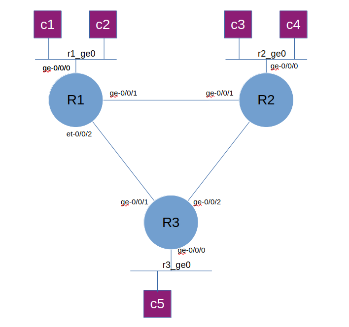

# Lab 1
## Lab topology

## node in the lab

### vJunos VM

node | type 
|-|-|
|r1 | vJunosRouter|
|r2 | vJunosRouter|
|r3 | vJunosrouter|

### Linux Container as client for traffic generator/testing connectivity

|node | connected to | vlan |ipv4 address|ipv6 address|
|-|-|-|-|-|
|c11 | r1 via ge-0/0/0| 101 | 192.168.10.1/24|fc00:dead:beef:Aa10::1000:1/64|
|c12| r1 via ge-0/0/0|  101| 192.168.10.2/24|fc00:dead:beef:Aa10::1000:2/64|
|c21 | r2 via ge-0/0/0| 102| 192.168.20.1/24|fc00:dead:beef:Aa20::1000:1/64|
|c22 | r2 via ge-0/0/0|102| 192.168.20.2/24|fc00:dead:beef:Aa20::1000:2/64|
|c31| r3 via ge-0/0/0|103| 192.168.30.1/24|fc00:dead:beef:Aa30::1000:1/64|
|c32| r3 via ge-0/0/0|103| 192.168.30.2/24|fc00:dead:beef:Aa30::1000:2/64|

## how to run the lab
1. enter the lab directory 

        cd ~/git/vJunos_on_KVM/lab/lab1

2. edit file [lab.yaml](./lab.yaml), and change the following
    - the disk image file name and location of the vJunos VM
    - target directory where the disk image of each vJunos VM will be stored ( vm_dir:)
    - bridge interface which will used as management interface 
    - ip_pool parameter (to match the ip address parameter configured on the bridge interface for management)

3. Run the script to create vJunos VM instances and create the bridges

        cd ~/git/vJunos_on_KVM/lab/lab1 
        ../../script/vlab.py create

4. Copy the kea-dhcp4.conf into /etc/kea and restart kea-dhcp4-server service

        sudo result/kea-dhcp4.conf /etc/kea/
        sudo systemctl restart kea-dhcp4-server

5. Copy vJunos VM initial configuration into /srv/tft

        sudo cp result/*.conf /srv/tftp

6. Start the topology

        ../../script/vlab.py start

7. wait until all vJunos VM is up and running and go through the ZTP process to get the initial configuration.

        to check you can access the console of vJunos VM. You can use command "virsh console <vm_name>" to access the console

        you can ping management ip address of the vJunos VM

        you can also open ssh session into vJunos VM, for example "ssh r1"

8. configure interface ge-0/0/0 of vJunos VM to enable routing from the client. there is [ansible playbook](setup/ansible/set_intf.yaml) for this, you can use it

        cd ~/git/vJunos_on_KVM/lab/lab1/setup/ansible
        ansible-playbook set_intf.yaml

9. Create LXC container to simulate client. there is a [shell script](setup/lxc/create_client.sh) to create multiple client
