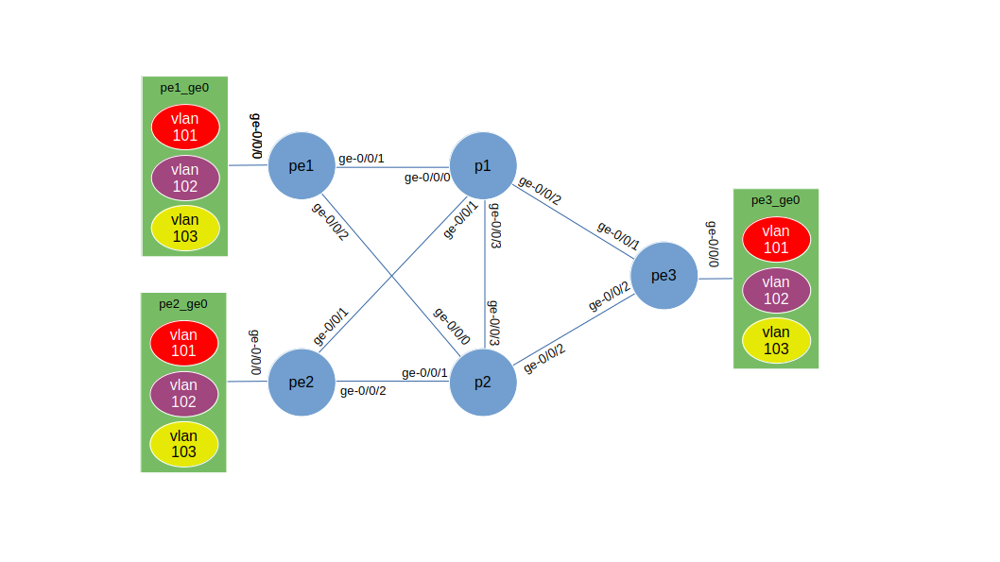
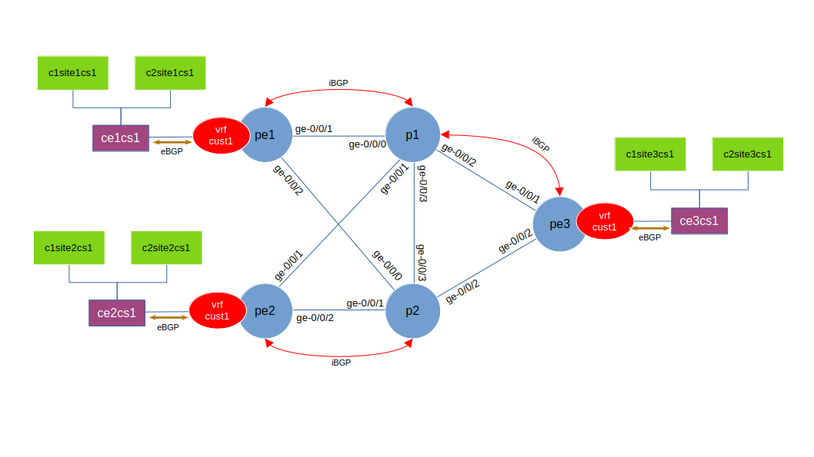
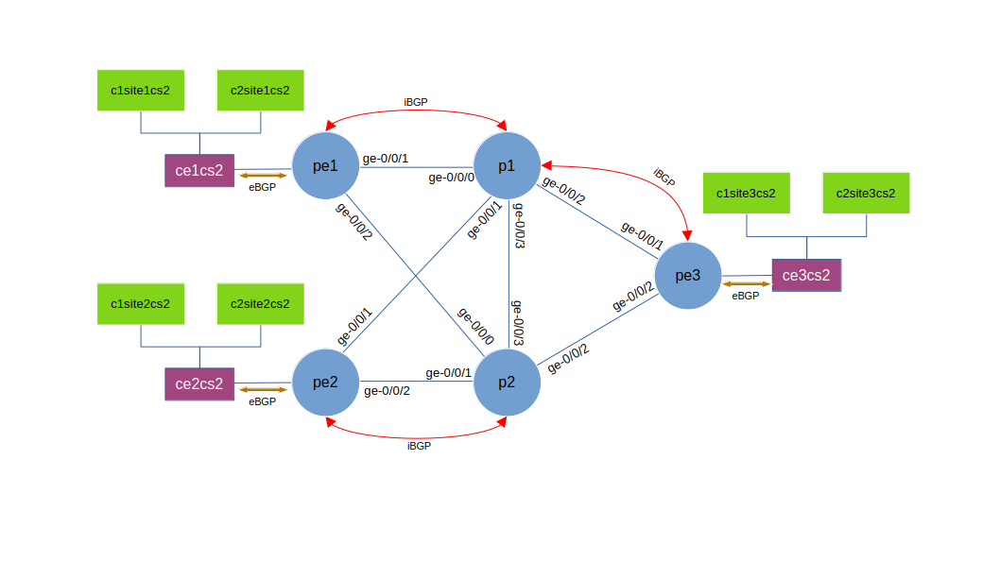
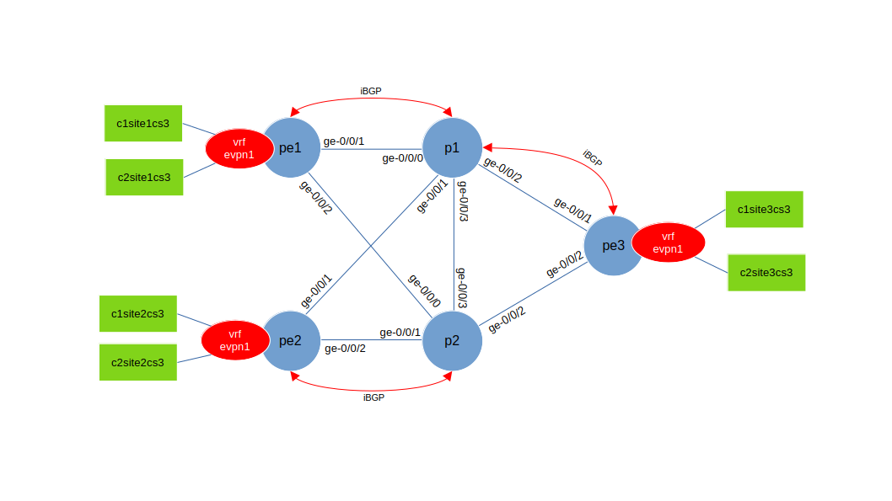

# Lab 2
## Lab topology

## node in the lab

### vJunos VM

node | type 
|-|-|
|pe1 | vJunosRouter|
|pe2| vJunosRouter|
|pe3| vJunosrouter|
|p1| vJunosrouter|
|p2| vJunosrouter|

### Linux Container as client for traffic generator/testing connectivity

Case 1
|node |type| connected to | vlan |ipv4 address|ipv6 address|
|-|-|-|-|-|-|
|ce1cs1 |router| pe1 via ge-0/0/0| 101 | 192.168.1.1/24|fc00:dead:beef:A101::1/64|
|c1site1cs1 | client|pe1 via ge-0/0/0|  101| 192.168.1.0/24|fc00:dead:beef:A101::/64|
|c2site1cs1 | client|pe1 via ge-0/0/0|  101| 192.168.1.0/24|fc00:dead:beef:A101::/64|
|ce2cs1 |router| pe2 via ge-0/0/0| 101 | 192.168.2.1/24|fc00:dead:beef:A102::1/64|
|c1site2cs1 | client|pe2 via ge-0/0/0|  101| 192.168.2.0/24|fc00:dead:beef:A102::/64|
|c2site2cs1 | client|pe2 via ge-0/0/0|  101| 192.168.2.0/24|fc00:dead:beef:A102::/64|
|ce3cs1 |router| pe3 via ge-0/0/0| 101 | 192.168.3.1/24|fc00:dead:beef:A103::1/64|
|c1site3cs1 | client|pe3 via ge-0/0/0|  101| 192.168.3.0/24|fc00:dead:beef:A103::/64|
|c2site3cs1 | client|pe3 via ge-0/0/0|  101| 192.168.3.0/24|fc00:dead:beef:A103::/64|

Case 2
|node |type| connected to | vlan |ipv4 address|ipv6 address|
|-|-|-|-|-|-|
|ce1cs2 |router| pe1 via ge-0/0/0| 102 | 192.168.1.1/24|fc00:dead:beef:A102::1/64|
|c1site1cs2 | client|pe1 via ge-0/0/0|  102| 192.168.1.0/24|fc00:dead:beef:A102::/64|
|c2site1cs2 | client|pe1 via ge-0/0/0|  102| 192.168.1.0/24|fc00:dead:beef:A102::/64|
|ce2cs2 |router| pe2 via ge-0/0/0| 102 | 192.168.2.1/24|fc00:dead:beef:A102::1/64|
|c1site2cs2 | client|pe2 via ge-0/0/0|  102| 192.168.2.0/24|fc00:dead:beef:A102::/64|
|c2site2cs2 | client|pe2 via ge-0/0/0|  102| 192.168.2.0/24|fc00:dead:beef:A102::/64|
|ce3cs2 |router| pe3 via ge-0/0/0| 102 | 192.168.3.1/24|fc00:dead:beef:A103::1/64|
|c1site3cs2 | client|pe3 via ge-0/0/0|  102| 192.168.3.0/24|fc00:dead:beef:A103::/64|
|c2site3cs2 | client|pe3 via ge-0/0/0|  102| 192.168.3.0/24|fc00:dead:beef:A103::/64|

Case 3
|node |type| connected to | vlan |ipv4 address|ipv6 address|
|-|-|-|-|-|-|
|c1site1cs3 | client|pe1 via ge-0/0/0|  103|172.16.20.11/24|fc00:dead:beef:aa20::1000:11/64|
|c2site1cs3 | client|pe1 via ge-0/0/0|  103|172.16.20.12/24|fc00:dead:beef:aa20::1000:12/64|
|c1site2cs3 | client|pe2 via ge-0/0/0|  103|172.16.20.21/24|fc00:dead:beef:aa20::1000:21/64|
|c2site2cs3 | client|pe2 via ge-0/0/0|  103|172.16.20.22/24|fc00:dead:beef:aa20::1000:22/64|
|c1site3cs3 | client|pe3 via ge-0/0/0|  103| 172.16.20.31/24|fc00:dead:beef:aa20::1000:31/64|
|c2site3cs3 | client|pe3 via ge-0/0/0|  103| 172.16.20.32/24|fc00:dead:beef:aa20::1000:32/64|

## Case

|Case | Description
|-|-|
|Case 1 | L3VPN betweeen PE, for both IPv4 and IPv6, and BGP between CE and PE|
|Case 2 | IP-Routing betweeen PE, for both IPv4 and IPv6, and BGP between CE and PE|
|Case 3 | L2 EVPN between PE |

## how to run the lab

Screenshot recording of these steps can be found [here](https://asciinema.org/a/K0NwwBLIfiNUm5XPgukkRUixC)

1. enter the lab directory 

        cd ~/git/vJunos_on_KVM/lab/lab2

2. edit file [lab.yaml](./lab.yaml), and change the following
    - the disk image file name and location of the vJunos VM
    - target directory where the disk image of each vJunos VM will be stored ( vm_dir:)
    - bridge interface which will used as management interface 
    - ip_pool parameter (to match the ip address parameter configured on the bridge interface for management)

3. Run the script to create vJunos VM instances and create the bridges

        cd ~/git/vJunos_on_KVM/lab/lab1 
        ../../script/vlab.py create

4. Copy the kea-dhcp4.conf into /etc/kea and restart kea-dhcp4-server service

        sudo result/kea-dhcp4.conf /etc/kea/
        sudo systemctl restart kea-dhcp4-server

5. Copy vJunos VM initial configuration into /srv/tftp

        sudo cp result/*.conf /srv/tftp

6. Start the topology

        ../../script/vlab.py start

7. wait until all vJunos VM is up and running and go through the ZTP process to get the initial configuration.

        to check you can access the console of vJunos VM. You can use command "virsh console <vm_name>" to access the console

        you can ping management ip address of the vJunos VM

        you can also open ssh session into vJunos VM, for example "ssh r1"

### Deploying case 1 configuration (L3VPN)

Screenshot recording of these steps can be found [here](https://asciinema.org/a/CIHzBwCkBhiqEhDHvk1fc8UpC)

1. configure node P1 as route reflector (RR). the configuration file for RR can be found [here](setup/ansible/p1.set)
2. configure node PE1, PE2, and PE3 using ansible playbook [set_bgp.yaml](setup/ansible/case1/set_bgp.yaml) and [set_vrf.yaml](setup/ansible/case1/set_vrf.yaml).

        cd ~/git/vJunos_on_KVM/lab/lab2/setup/ansible
        ansible-playbook case1/set_bgp.yaml
        ansible-playbook case1/set_vrf.yaml

2. Create LXC container to simulate CE router (ce1cs1, ce2cs1, ce3cs1) using shell script [create_site.sh](setup/lxc/case1/create_site.sh) 

        cd ~/git/vJunos_on_KVM/lab/lab2/setup/lxc/case1
        ./create_site.sh
        lxc ls
        lxc exec ce1cs1 sh
        vtysh 
        show ip bgp summary
        ....

3. Create LXC container to simulate CE router (c1site1cs1, c1site2cs1, ... c2site3cs1) using shell script [create_client_per_site.sh](setup/lxc/case1/create_client_per_site.sh) 

        cd ~/git/vJunos_on_KVM/lab/lab2/setup/lxc/case1
        ./create_client_per_site.sh
        lxc ls
        lxc exec c1site1cs1 sh
        ping 192.168.2.XXX
        ....

4. SSH into node PE1/PE2/PE3 to verify that configuration has been deployed

        ssh pe1
        show configuration 
        show bgp summary
        show router table cust1.inet.0
        show router table cust1.inet6.0

### Deploying case 2 configuration (IP Routing)

Screenshot recording of these steps can be found [here](https://asciinema.org/a/WC3lm9fo3nbUgq0GljPlQavm6)

1. configure node PE1, PE2, and PE3 using ansible playbook [set_bgp.yaml](setup/ansible/case2/set_bgp.yaml) 

        cd ~/git/vJunos_on_KVM/lab/lab2/setup/ansible
        ansible-playbook case2/set_bgp.yaml

2. Create LXC container to simulate CE router (ce1cs2, ce2cs2, ce3cs2) using shell script [create_site.sh](setup/lxc/case2/create_site.sh) 

        cd ~/git/vJunos_on_KVM/lab/lab2/setup/lxc/case2
        ./create_site.sh
        lxc ls
        lxc exec ce1cs2 sh
        vtysh 
        show ip bgp summary
        ....

3. Create LXC container to simulate CE router (c1site1cs2, c1site2cs2, ... c2site3cs2) using shell script [create_client_per_site.sh](setup/lxc/case2/create_client_per_site.sh) 

        cd ~/git/vJunos_on_KVM/lab/lab2/setup/lxc/case2
        ./create_client_per_site.sh
        lxc ls
        lxc exec c1site1cs2 sh
        ping 192.168.2.XXX
        ....

4. SSH into node PE1/PE2/PE3 to verify that configuration has been deployed

        ssh pe1
        show configuration 
        show bgp summary
        show router table inet.0
        show router table inet6.0

### Deploying case 3 configuration (EVPN)

Screenshot recording of these steps can be found [here](https://asciinema.org/a/kaQ0hnuH8QTnxREZoFtTHEHYE)

1. configure node PE1, PE2, and PE3 using ansible playbook [set_evpn.yaml](setup/ansible/case3/set_evpn.yaml) 

        cd ~/git/vJunos_on_KVM/lab/lab3/setup/ansible
        ansible-playbook case3/set_evpn.yaml

2. Create LXC container to simulate CE router (c1site1cs2, c1site2cs2, ... c2site3cs2) using shell script [create_client_per_site.sh](setup/lxc/case2/create_client_per_site.sh) 

        cd ~/git/vJunos_on_KVM/lab/lab2/setup/lxc/case3
        ./create_client_per_site.sh
        lxc ls
        lxc exec c1site1cs3 sh
        ping  172.16.20.XXX
        ....

4. SSH into node PE1/PE2/PE3 to verify that configuration has been deployed

        ssh pe1
        show configuration 
        show bgp summary

