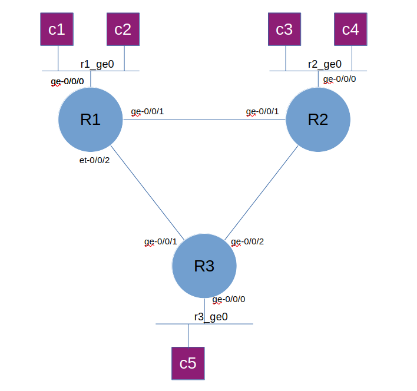

# Lab 1
## Lab topology

## node in the lab

### vJunos VM

node | type 
|-|-|
|r1 | vJunosRouter|
|r2 | vJunosRouter|
|r3 | vJunosrouter|

### Linux Container as client for traffic generator/testing connectivity

|node | connected to | vlan |ipv4 address|ipv6 address|
|-|-|-|-|-|
|c11 | r1 via ge-0/0/0| 101 | 192.168.10.1/24|fc00:dead:beef:Aa10::1000:1/64|
|c12| r1 via ge-0/0/0|  101| 192.168.10.2/24|fc00:dead:beef:Aa10::1000:2/64|
|c21 | r2 via ge-0/0/0| 102| 192.168.20.1/24|fc00:dead:beef:Aa20::1000:1/64|
|c22 | r2 via ge-0/0/0|102| 192.168.20.2/24|fc00:dead:beef:Aa20::1000:2/64|
|c31| r3 via ge-0/0/0|103| 192.168.30.1/24|fc00:dead:beef:Aa30::1000:1/64|
|c32| r3 via ge-0/0/0|103| 192.168.30.2/24|fc00:dead:beef:Aa30::1000:2/64|

